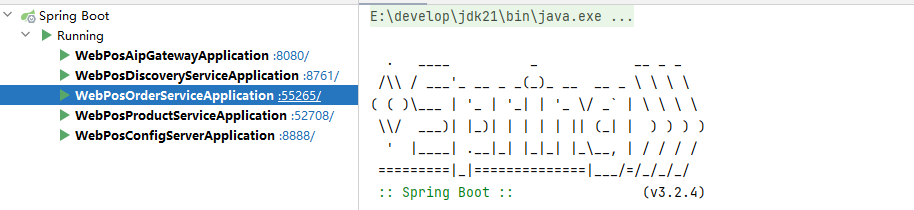
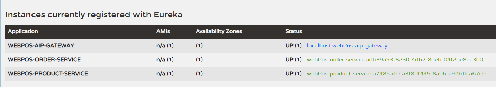
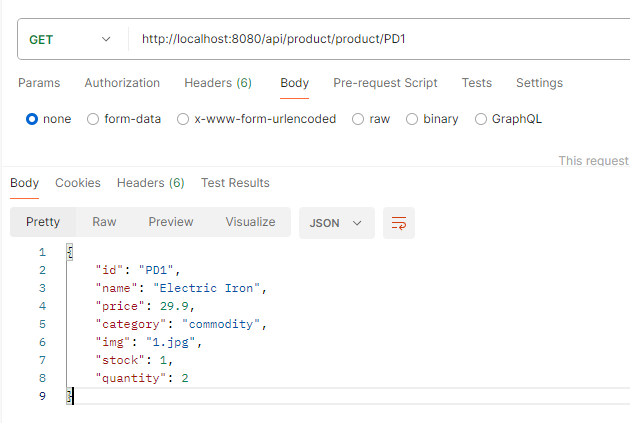
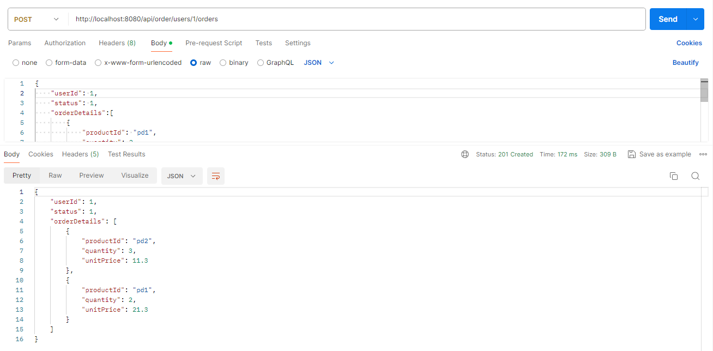
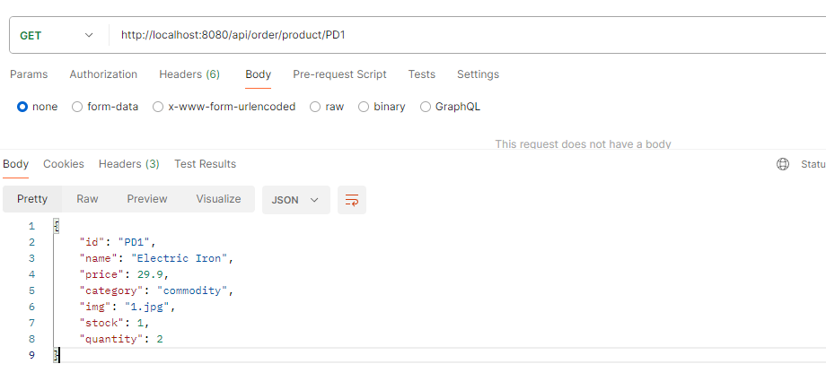
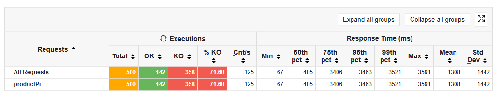
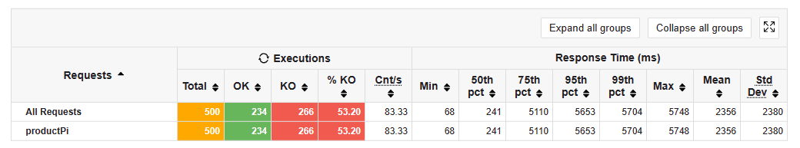

# Micro WebPoS 

> 请参考spring-petclinic-rest/spring-petclinic-microserivces 将webpos项目改为微服务架构，具体要求包括：
> 1. 至少包含独立的产品管理服务、订单管理服务以及discovery/gateway等微服务架构下需要的基础设施服务；
> 2. 请将系统内的不同微服务实现不同的计算复杂度，通过压力测试实验验证对单个微服务进行水平扩展（而无需整个系统所有服务都进行水平扩展）可以提升系统性能，请给出实验报告；
> 3. 请使用`RestTemplate`进行服务间访问，验证Client-side LB可行；
> 4. 请注意使用断路器等机制；
> 5. 如有兴趣可在kubernetes或者minikube上进行部署。
> 
> 请编写readme对自己的系统和实验进行详细介绍。

## 系统结构介绍

WebPos 系统由以下微服务组件构成：
* webPos-config-server: 配置服务器，地址：http://localhost:8888
* webPos-discovery-server: 注册中心，用于微服务的注册与发现, 地址：http://localhost:8761
* webPos-api-gateway: 网关，用于统一管理所有微服务的接口，并实现负载均衡：http://localhost:8080
* webPos-product-service: 产品管理微服务,用于维护产品资源
* webPos-order-service: 订单管理微服务,用于维护订单资源

### API 网关
对于 Product Service 和 Order Service 的访问统一由网关进行管理，网关会分别将以 http://localhost:8080/api/product/* 和 
http://localhost:8080/api/order/* 格式的请求转发到对应的服务。当有多个服务实例时，Spring Cloud Gateway 会根据服务实例的健康状况和负载情况来动态转发请求。

在网关中，还配置了 Resilience4j **断路器（Circuit Breaker）**， 用于在服务出现故障或延迟时（设置超时时间为 4s）， 阻止对该服务的请求，从而避免对服务的进一步负载，同时提高整体系统的稳定性。

### Product & Order Service

Product Service 和 Order Service 分别维护了产品信息和订单信息，并提供了相应的 RESTful 接口，供其他微服务调用。Product Service 延续了 aw5 的设计，
而 Order Service 提供了订单创建和查询功能。两者都是以内置 H2 数据库对数据进行持久化存储。

出于实验考虑， **Order Service 中会通过 ResTemplate 请求 Product Service 中的 /product/{productId}**（获取指定 Product 信息）和 /product/pi（具有计算负载的请求） 请求用于验证服务间访问、和客户端负载均衡功能。

## 实验报告

### 1. 基本功能验证
启动服务，各服务从 config Server 获取配置信息，初始化，然后在 Eureka 进行注册和发现其他服务。 

访问 Eureka 的界面地址：http://localhost:8761/ 可以看到服务的注册情况；

以下是通过 api 网关访问，product 和 order service 的测试：

**（1）获取指定 Product 的信息**： http://localhost:8080/api/product/product/PD1

**（2）创建 Order:**  http://localhost:8080/api/order/users/1/orders

**（3）通过 Order 调用 Product 微服务**： http://localhost:8080/api/order/product/PD1

### 2. 负载均衡测试

这里对 Product Service 进行不同程度的水平项拓展给整体系统带来的性能提升，测试接口为具有加大计算复杂度的  /product/pi 请求，测试结果如下图所示：

* Product Service 部署 1 个实例， 测试结果：
  
* Product Service 部署 2 个实例， 测试结果：
  
* Product Service 部署 3 个实例， 测试结果：
  
* Product Service 部署 4 个实例， 测试结果：
  

可以看到随着部署的 Product Service 实例数量增加，系统的性能提升非常明显，请求失败率从最开始 76.2% 下降到最后的 24%；

同样，还通过 Order Service 使用配置了负载均衡 ResTemplte 请求 Product Service 服务，得到结论与上述类似。
